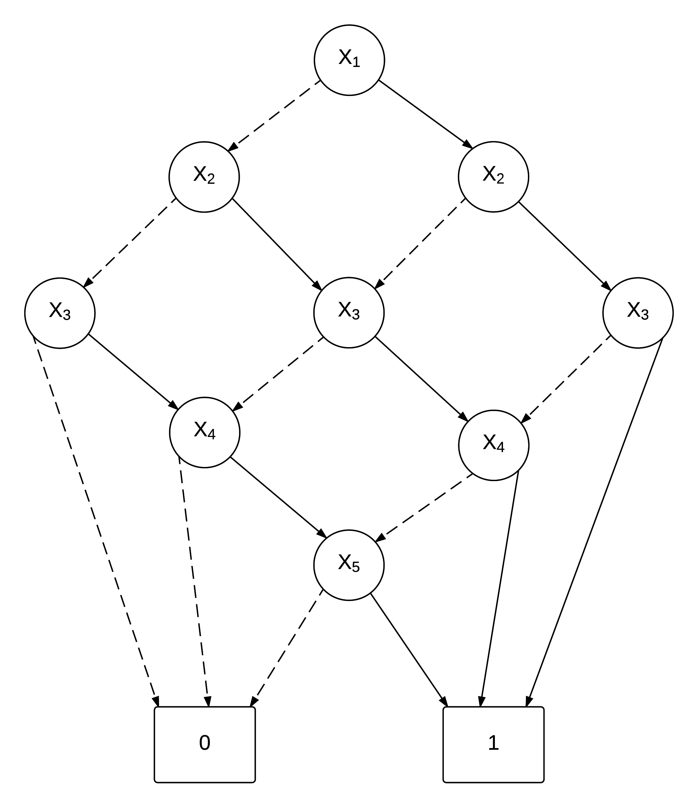
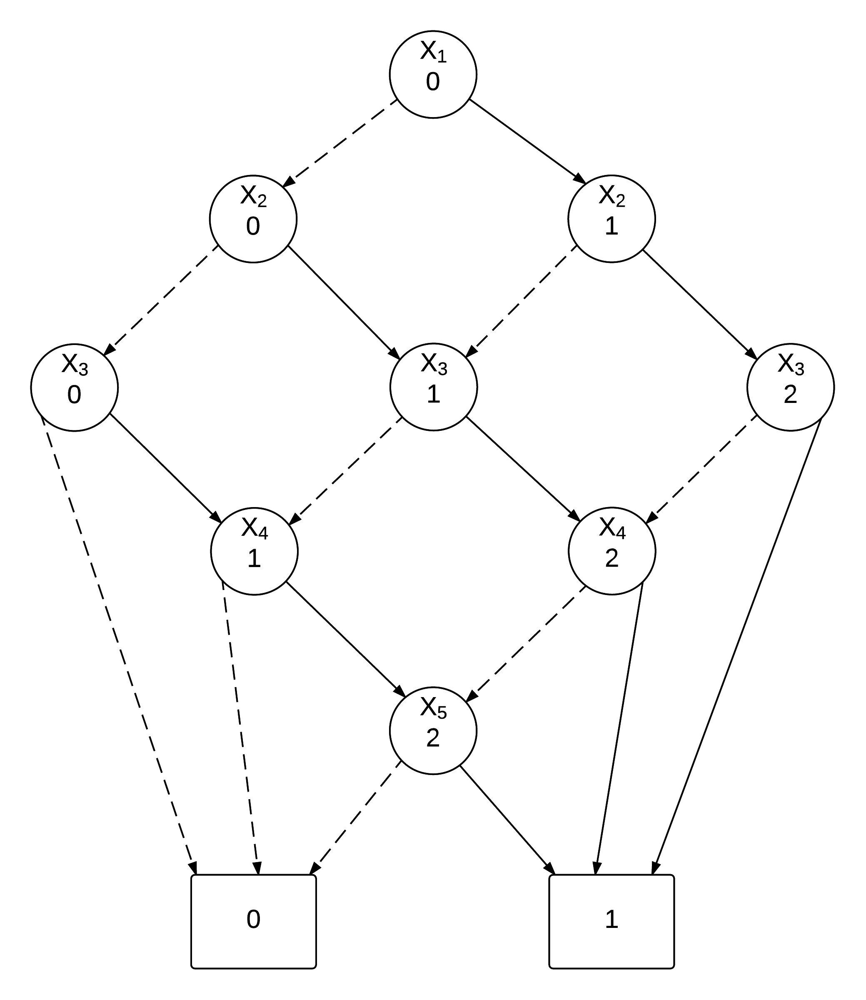

# Mandatory Exercise - 
**Anders Wind - awis@itu.dk**

## Task 1
Here is my ROBDD tree of the threshold function with k = 3 and n = 5 with the order of x1, x2, x3, x4, x5

## Task 2
Here is the same picture as above but with labels on each node indicating how many truth values have been reached up until this point.

## Task 3
When you reduce the binary tree of a threshold function you make sure that at a given variable only appears 1 time for each state it is able to be in.
Since we limit the amount of states to zero to (k-1) we can say that each variable can only appear k times. 
Then we get n variables a maximum of k times = O(nk)
